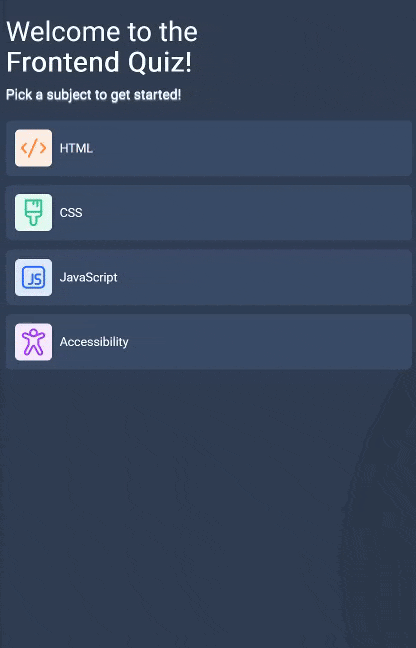

# Frontend Quiz App

A modern, responsive quiz application designed to test web development knowledge.

## 🔗 Links

- **Live Demo Link:**

## 🧠 Quiz Showcase

## 🧐 About The Project

The application fetches quiz data asynchronously from a JSON source, allowing for a dynamic experience where questions can be updated without altering the codebase. It features to track the user's current subject, score, and progress through the 10-question subsets.

### Key Features

- **Modern Tooling:**
  - **Vite:** Used for lightning-fast hot module replacement (HMR) and optimized building.
  - **Bun:** Utilized as the high-performance package manager and runtime.
- **Topic Selection:** Users can choose between HTML, CSS, JavaScript, and Accessibility quizzes.
- **Visual Progress:**
  - A dynamic progress bar updates in real-time as the user advances.
- **Responsive Architecture:** Built **Mobile-First** using Tailwind's utility classes to ensure a perfect layout on phones, tablets, and desktops.
- **Score Summary:** A dedicated results screen displays the final score and offers a quick "Play Again" loop.
